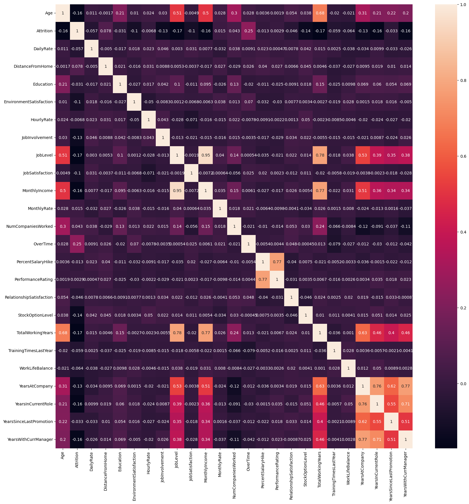
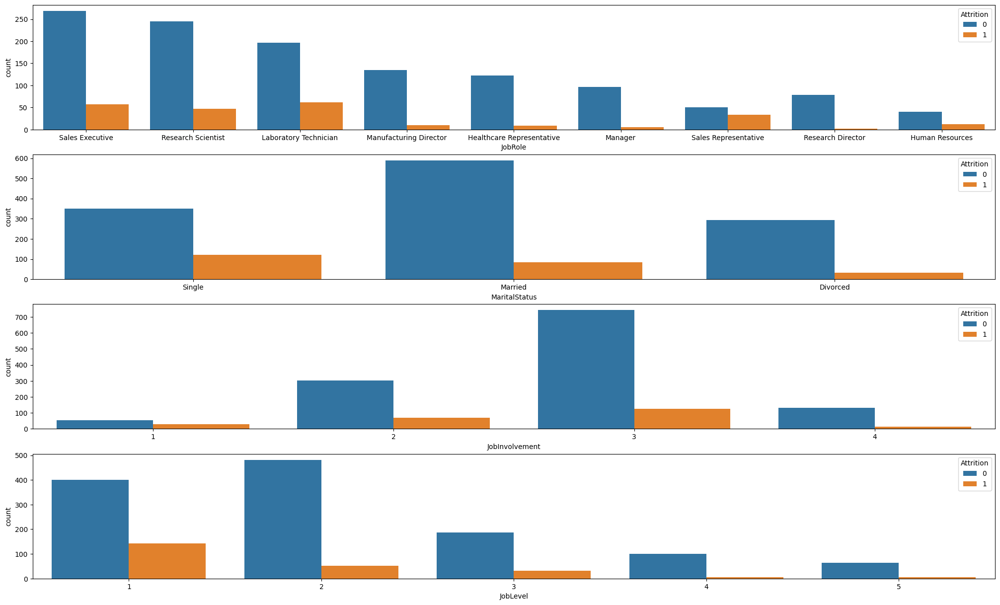
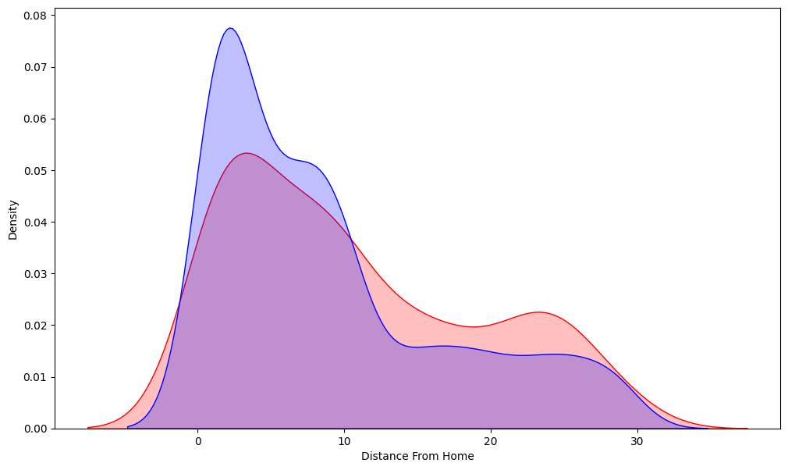
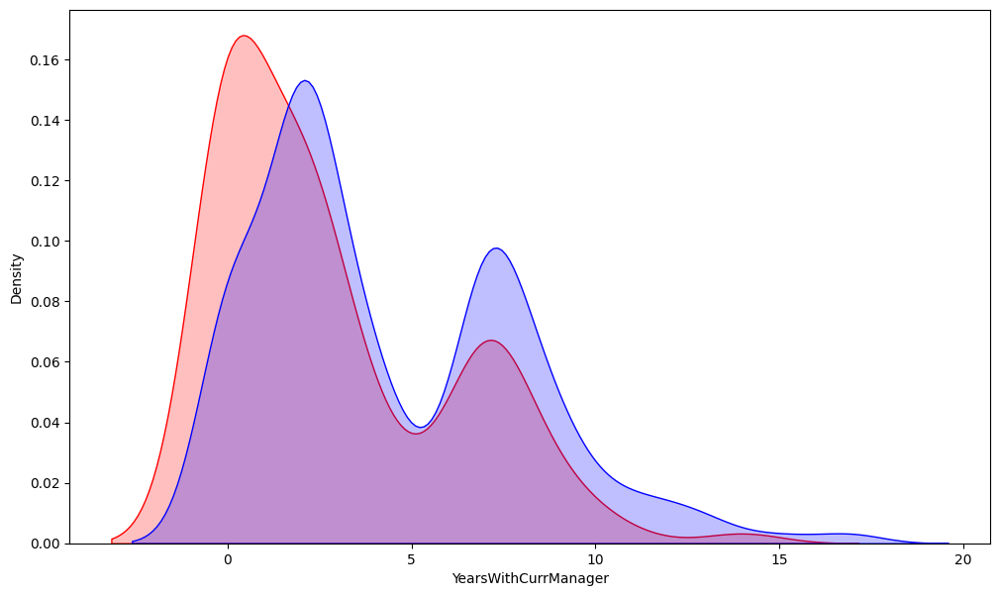
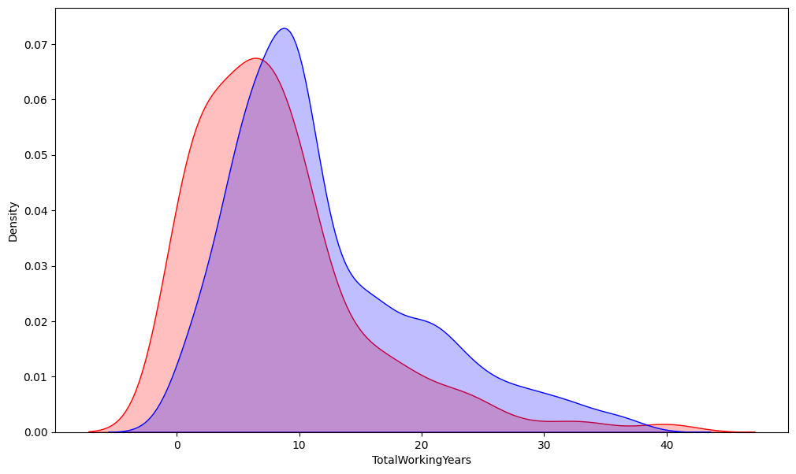
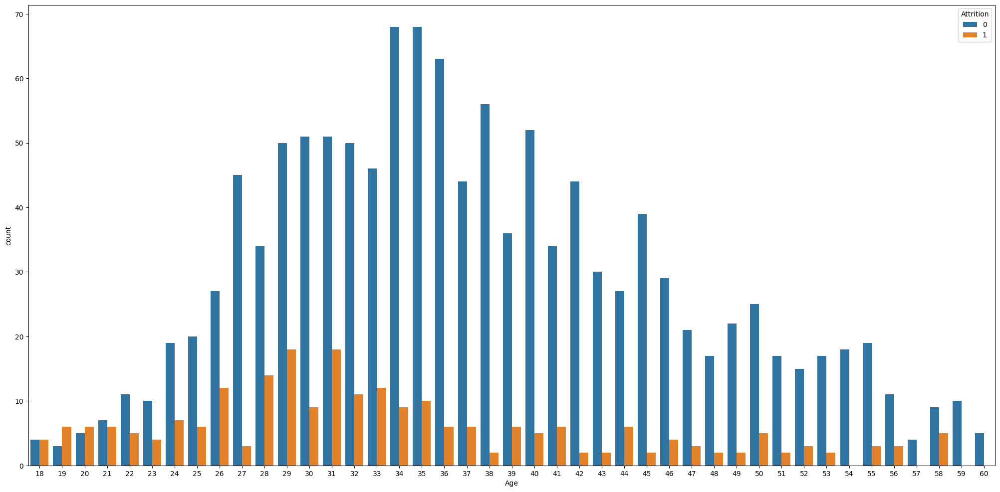
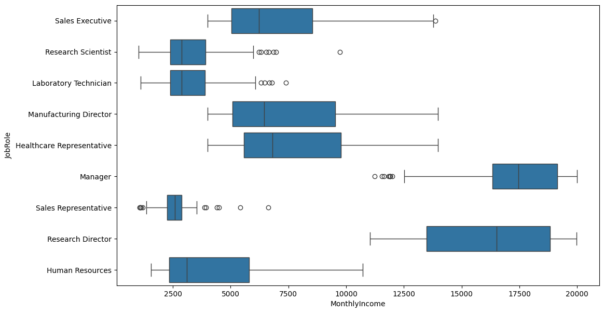

# HR-Attrition-Analysis-and-Prediction

## 📌 Project Overview
Employee attrition is a critical challenge for organizations, impacting productivity, recruitment costs, and overall business performance. This project analyzes an **HR Attrition dataset of 1,500 employees**, performs **feature engineering**, and implements **machine learning models** to predict employee attrition.

The project follows an **end-to-end workflow**, including **data exploration, preprocessing, modeling, evaluation, and comparison** of three classification algorithms.

---

## 🗂 Dataset
- **Source:** Internal HR dataset   
- **Size:** 1,470 employee records  
- **Features:** Demographics, job satisfaction, work experience, performance metrics, etc.  
- **Target:** `Attrition` (Yes/No)

> Dataset is included in this repository as `HR_Attrition_Dataset.csv`.

---

## 🔧 Libraries & Tools
- Python 3.x  
- Pandas, NumPy  
- Matplotlib, Seaborn  
- Scikit-learn  
- TensorFlow / Keras (for ANN)  
- Jupyter Notebook  

---

## 🧩 Exploratory Data Analysis (EDA)  

We performed a detailed exploration of the dataset to understand distributions, correlations, and patterns related to employee attrition. Key visualizations are included below:

### 1️⃣ Correlation Heatmap

### 2️⃣ Countplots

### 3️⃣ Distribution Plots

### 4️⃣ KDE Plots
- DistancefromHome Feature in Employees who left and stayed  
    
- YearswithCurrentManager Feature in Employees who left and stayed   
    
- TotalworkingYear Feature in Employees who left and stayed  
  

### 5️⃣ Age vs Attrition

### 6️⃣ Box Plots  
- Final Box Plots  
  

> **Feature Engineering:**  
> - Encoding categorical variables  
> - Scaling numerical features  
> - Feature selection for better model performance  

---

## 🔧 Modeling  

Three classification models were implemented to predict employee attrition:

1. **Logistic Regression**  
2. **Random Forest Classifier**  
3. **Artificial Neural Network (ANN)**

---

## 📊 Model Evaluation  

### Model Performance Metrics

| Model                     | Accuracy | Precision | Recall | F1-Score |
|---------------------------|---------|-----------|--------|----------|
| Logistic Regression       | 0.90    | 0.80      | 0.68   | 0.72     |
| Random Forest             | 0.88    | 0.82      | 0.56   | 0.57     |
| Artificial Neural Network (ANN) | 0.87 | 0.70 | 0.65   | 0.67     |

✅ **Notes:**  
- **Precision, Recall, F1-Score** are **macro averages**.  
- Random Forest has high precision but low recall for class `1` (employees leaving), meaning it predicts staying employees more reliably.  
- Logistic Regression provides a balanced performance across metrics, while ANN is slightly lower in recall but still robust.  

---

### Confusion Matrices

#### Logistic Regression

#### Random Forest

#### Artificial Neural Network (ANN)

---

## 🚀 Key Insights
- Employees with **low job satisfaction** are more likely to leave.  
- **Years at company** and **promotion history** are strong predictors of attrition.  
- **Random Forest** achieved high precision but low recall for attrition, while Logistic Regression provides the most balanced performance.  

---

## 💡 Future Work
- Hyperparameter tuning for better model performance  
- Incorporate more employee behavioral or engagement metrics  
- Deploy the model as a **web application** for HR dashboards  
